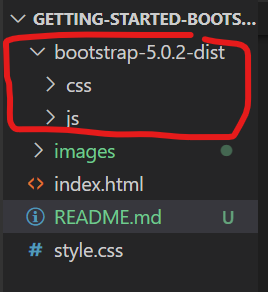

## Guided Project on Bootstrap Responsive Designs.
## Getting Started
Bootstrap is the world’s most popular framework for building responsive, mobile-first sites. 
It's made of: <b>CSS</b> and <b>JavaScript</b> files. 
- See below started code:
```
<!doctype html>
<html lang="en">
  <head>
    <!-- Required meta tags -->
    <meta charset="utf-8">
    <meta name="viewport" content="width=device-width, initial-scale=1">

    <!-- Bootstrap CSS -->
    <link href="path/to/css/file" rel="stylesheet">

    <title>Hello, world!</title>
  </head>
  <body>
    <h1>Hello, world!</h1>

    <!-- Optional JavaScript; choose one of the two! -->

    <!-- Option 1: Bootstrap Bundle with Popper -->
    <script src="https://cdn.jsdelivr.net/npm/bootstrap@5.0.2/dist/js/bootstrap.bundle.min.js" integrity="sha384-MrcW6ZMFYlzcLA8Nl+NtUVF0sA7MsXsP1UyJoMp4YLEuNSfAP+JcXn/tWtIaxVXM" crossorigin="anonymous"></script>

    <!-- Option 2: Separate Popper and Bootstrap JS -->
    <!--
    <script src="path/to/jsbundle/file" ></script>
    <script src="path/to/js/minified file"></script>
    -->
  </body>
</html>

```
## Important global
### 1. HTML doctype
Bootstrap requires the use of the HTML5 doctype. Without it, you’ll see some funky incomplete styling, but including it shouldn’t cause any considerable hiccups.

```
<!doctype html>
<html lang="en">
  ...
</html>
```
### 2. Responsive Metatag
To ensure proper rendering and touch zooming for all devices,we add the responsive viewport meta tag to the `<head>`

```
<meta name="viewport" content="width=device-width, initial-scale=1">
```
## Setting Up
Download ready-to-use compiled code for Bootstrap v5.0.2 to easily drop into your project. The downloaded folder includes:

- Compiled and minified CSS bundles
- Compiled and minified JavaScript plugins
Link to download: [Download Bootstrap](https://github.com/twbs/bootstrap/releases/download/v5.0.2/bootstrap-5.0.2-dist.zip)

Once the folder has been downloaded, extract in your working directory as shown.


### b. Link your files in your index.html.

```
<!DOCTYPE html>
<html lang="en">
<head>
    <meta charset="UTF-8">
    <meta http-equiv="X-UA-Compatible" content="IE=edge">
    <meta name="viewport" content="width=device-width, initial-scale=1.0">
    
    <!-- Option 2:  Bootstrap CSS -->
    <link href="bootstrap-5.0.2-dist/css/bootstrap.min.css" rel="stylesheet">

    <title>Bootstrap Getting Started</title>

</head>
<body>
    <div class="container " >
      
    <!-- Option 2:  Bootstrap JS -->
    
    <script src="bootstrap-5.0.2-dist/js/bootstrap.bundle.min.js" crossorigin="anonymous"></script>
    <script src="bootstrap-5.0.2-dist/js/bootstrap.min.js" crossorigin="anonymous"></script>
   
</body>
</html>

```

Congratulations you have set up environmental configuration for Bootstrap.
